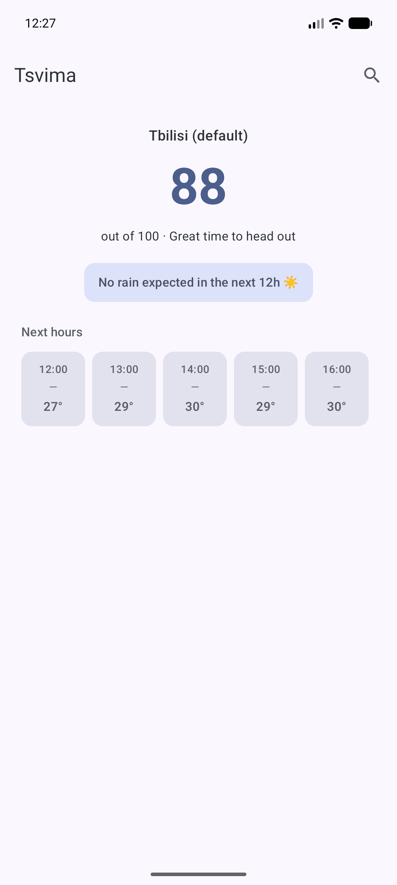
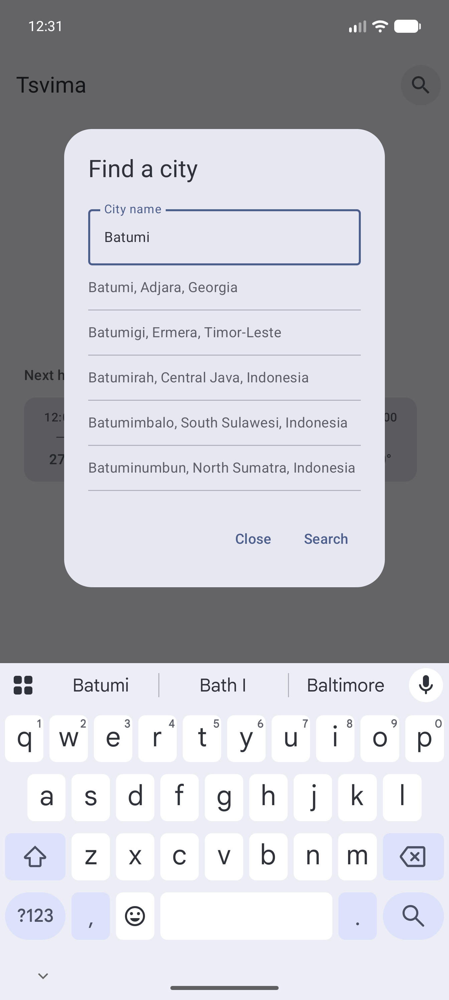
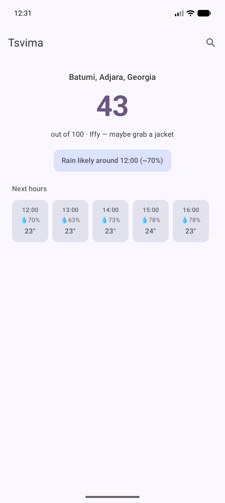

# Tsvima 🌧

**წვიმა** (*tsvima* — Georgian for "rain") — a focused, one-glance **rain nowcast**
for Android.

Not another do-everything weather app. Tsvima answers one question well: **is it
about to rain, and is right now a good time to head out?** It shows the next hours of
precipitation and a simple "go-out" score, from **[Open-Meteo](https://open-meteo.com/)**
(free, no API key).

## Screenshots

| Home | Find a city | Rain incoming |
|:---:|:---:|:---:|
|  |  |  |

## Features

- 🏃 **Go-out score** — a 0–100 "good time to be outside / run" score, with a plain-English
  verdict, derived from imminent rain, temperature, and wind.
- 🌦️ **Next-rain line** — "Rain likely around 15:00 (~70%)" or "No rain expected in the next 12h".
- ⏱️ **Hourly timeline** — precipitation chance and temperature for the coming hours.
- 📍 **Your location** — device coarse location with permission handling, plus a **city search**
  (Open-Meteo geocoding) when you want a different place.
- 📴 **Offline glance** — the last forecast is cached (DataStore); open offline and it shows the
  last result with a clear "offline" hint.
- 🔄 **Pull-to-refresh** and a friendly error + Retry state.
- 🎨 **Material 3** — dynamic color, light/dark, edge-to-edge.

## Architecture — Kotlin Multiplatform

Structured as a **KMM** project (Android target for now, iOS-ready):

```
shared/     Kotlin Multiplatform library (commonMain + commonTest)
            · Open-Meteo forecast + geocoding parsers (kotlinx-serialization)
            · go-out score, forecast models, cache codec — all pure & unit-tested
androidApp/ Android app: OkHttp clients, device location, DataStore cache,
            Compose UI (home, hourly timeline, city-search dialog)
```

The pure domain lives in `shared/commonMain` with tests in `commonTest`; everything
platform-specific (networking, location, persistence, UI) stays in `androidApp`.

- Gradle 9.3.1 · AGP 9.1.1 · Kotlin 2.3.21 · Compose BOM 2026.06.01
- compileSdk 36 · minSdk 26

## Build & run

```bash
git clone https://github.com/Meko123456/Tsvima.git
cd Tsvima
./gradlew :androidApp:assembleDebug     # or open in Android Studio and Run
./gradlew :shared:testAndroidHostTest   # run the shared unit tests
```

## Status

✅ **v0.1.0** — go-out score, hourly nowcast, device location + city search, and offline
cache all working. See [issues](../../issues) for what's next (a Glance home-screen widget).

## License

[MIT](LICENSE)
