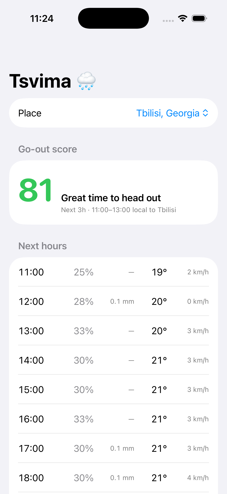

# Tsvima 🌧

**წვიმა** (*tsvima* — Georgian for "rain") — a focused, one-glance **rain nowcast**
for Android, with a first native iOS screen driven by the same shared Kotlin core.

Not another do-everything weather app. Tsvima answers one question well: **is it
about to rain, and is right now a good time to head out?** It shows the next hours of
precipitation and a simple "go-out" score, from **[Open-Meteo](https://open-meteo.com/)**
(free, no API key).

## Screenshots

Android:

| Home | Find a city | Rain incoming |
|:---:|:---:|:---:|
|  |  |  |

## Features

- 🏃 **Go-out score** — a 0–100 "good time to be outside / run" score, with a plain-English
  verdict, derived from imminent rain, temperature, and wind.
- 🌦️ **Next-rain line** — "Rain likely around 15:00 (~70%)" or "No rain expected in the next 12h".
- ⏱️ **Hourly timeline** — precipitation chance and temperature for the coming hours.
- 📍 **Your location** — device coarse location with permission handling, plus a **city search**
  (Open-Meteo geocoding) when you want a different place.
- 📴 **Offline glance** — the last forecast is cached (DataStore); open offline and it shows the
  last result with a clear "offline" hint.
- 🔄 **Pull-to-refresh** and a friendly error + Retry state.
- 🎨 **Material 3** — dynamic color, light/dark, edge-to-edge.

## Architecture — Kotlin Multiplatform

Structured as a **KMM** project. `:shared` builds for Android **and** iOS
(`iosArm64`, `iosSimulatorArm64`), and CI runs its tests on both — the same 19 tests on
an Android host JVM and on an iOS simulator. `iosApp/` links the resulting
`Shared.framework` into a SwiftUI app, so the shared core now drives a native UI rather
than only compiling for one. Android is still the complete app.

```
shared/     Kotlin Multiplatform library (commonMain + commonTest)
            · Open-Meteo forecast + geocoding parsers (kotlinx-serialization)
            · go-out score, forecast models, cache codec — all pure & unit-tested
            · targets: Android, iosArm64, iosSimulatorArm64 (Shared.framework)
androidApp/ Android app: OkHttp clients, device location, DataStore cache,
            Compose UI (home, hourly timeline, city-search dialog)
iosApp/     SwiftUI app: URLSession fetch, the shared parser and score, native UI
            · generated from project.yml by XcodeGen — the .xcodeproj is not committed
```

The pure domain lives in `shared/commonMain` with tests in `commonTest`; everything
platform-specific — networking, location, persistence, UI — stays in the app modules.

- Gradle 9.7.1 · AGP 9.1.1 · Kotlin 2.4.10 · Compose BOM 2026.06.01
- compileSdk 37 · minSdk 26

## Build & run

```bash
git clone https://github.com/Meko123456/Tsvima.git
cd Tsvima
./gradlew :androidApp:assembleDebug       # or open in Android Studio and Run
./gradlew :shared:testAndroidHostTest     # shared unit tests, Android host JVM
./gradlew :shared:iosSimulatorArm64Test   # the same tests on an iOS simulator (macOS)
```

## iOS app



A first native screen, built to check that the shared core can actually drive a UI rather
than only compile for one.

**It fetches live.** Swift's `URLSession` makes the same Open-Meteo request the Android
client makes and hands the response body straight to the shared `ForecastParser`;
`GoOutScore` produces the number and the verdict. No sample response is bundled, so when
the network is down the screen says so rather than showing something that looks like a
forecast and is not. Open-Meteo is free and key-less, so there was nothing to keep out of
the repo that would have justified canned data.

Swift does exactly two things of its own. It makes the HTTPS request, and it picks which
hours count as "upcoming" — on the **forecast location's** clock, not the phone's, via
`Forecast.utcOffsetSeconds`. That second one restates a decision `androidApp` makes in
`Upcoming.fromNow`, which is written against `java.time` and so cannot move to
`commonMain` as it stands; lifting it is the obvious next step. Until it moves, the iOS
screen shows no "next rain" line rather than restating that threshold in a second
language.

Not there yet, and deliberately so: device location, the city search (a short fixed list
of places stands in), the offline cache, and the home-screen widget. Android has all four.

```bash
brew install xcodegen
cd iosApp && xcodegen generate         # the .xcodeproj is generated, not committed
xcodebuild -project Tsvima.xcodeproj -scheme Tsvima \
           -sdk iphonesimulator -destination 'generic/platform=iOS Simulator' build
```

Building the app builds `Shared.framework` first, as an Xcode pre-build step, so Xcode
needs a JDK: `export JAVA_HOME=...` if `./gradlew` does not already work in your shell.

## Status

✅ **v0.1.0** — go-out score, hourly nowcast, device location + city search, and offline
cache all working — and the Glance home-screen widget that used to be listed here is shipped.
The iOS app is one screen so far: live forecast and go-out score, no location or cache yet.

## License

[MIT](LICENSE)
